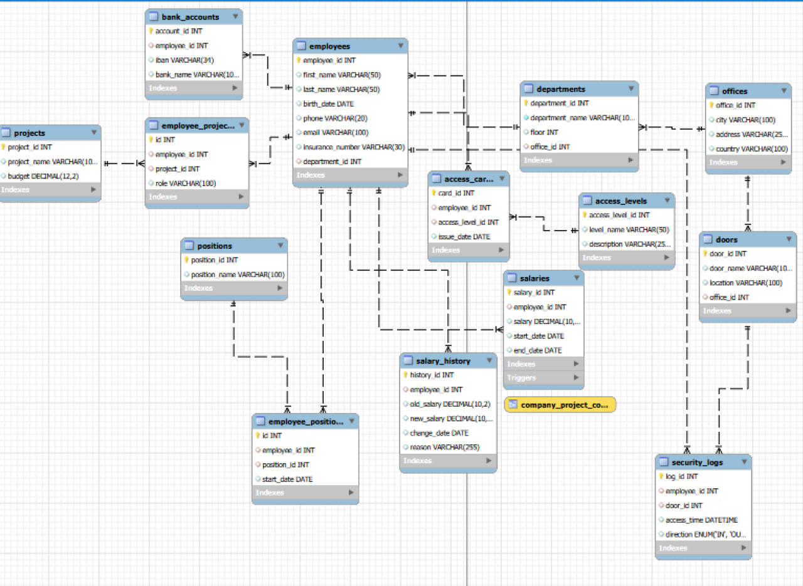

# Enterprise System Database

## Overview

This project demonstrates the design and implementation of a relational database for managing enterprise operations.
The system models internal company processes including employee management, department structure, project assignments, salary tracking, and office access logging.

The database was implemented using MySQL and follows established relational database design principles such as normalization, referential integrity, and modular schema organization.

The project simulates a simplified enterprise resource management system and demonstrates practical SQL development skills.

---

## Database Features

The system supports several enterprise management functions:

* employee information management
* department and office structure
* project assignment tracking
* salary management with history tracking
* employee position tracking
* access card and office door control
* access logging for security monitoring

Key database concepts implemented:

* relational schema design
* normalization (3NF)
* foreign key relationships
* indexes and constraints
* triggers
* stored procedures
* analytical SQL queries

---

## Database Structure

The database contains multiple interconnected tables that represent core enterprise entities.

### Core Entities

* `employees` – employee personal information
* `departments` – company departments
* `offices` – office locations
* `positions` – available job positions
* `projects` – company projects

### Relationship Tables

* `employee\_positions` – employee position assignments and history
* `employee\_projects` – employee participation in projects

### Financial Data

* `salaries` – current employee salary records
* `salary\_history` – history of salary changes
* `bank\_accounts` – employee bank account information

### Security and Access Control

* `access\_cards` – employee access cards
* `access\_levels` – card access levels
* `doors` – office door locations
* `security\_logs` – employee access events

---

## ER Diagram

The entity relationships and database schema are illustrated in the ER diagram below.



---

## Database Trigger

### `salary\_change\_trigger`

This trigger automatically records salary changes.

When a salary value is updated in the `salaries` table, the system inserts a record into the `salary\_history` table containing:

* employee ID
* previous salary
* new salary
* change date
* reason for change

This ensures automatic audit tracking of salary modifications.

---

## Stored Procedure

### `company\_employee\_report()`

This stored procedure generates a report that combines employee, department, position, and salary data.

It joins the following tables:

* `employees`
* `departments`
* `employee\_positions`
* `positions`
* `salaries`

Example usage:

```sql

CALL company\_employee\_report();

```

The procedure returns a report showing:

* employee name
* department
* position
* current salary

---

## Database View

### `company\_project\_costs`

This view provides an analytical overview of project workforce costs.

The view calculates:

* number of employees assigned to each project
* total salary cost of employees participating in the project

Example query:

```sql

SELECT \* FROM company\_project\_costs;

```

---

## Example Analytical Queries

### Total salary cost by department

```sql

SELECT 

&nbsp;   d.department\_name,

&nbsp;   COUNT(e.employee\_id) AS employees\_count,

&nbsp;   SUM(s.salary) AS total\_salary

FROM departments d

JOIN employees e

&nbsp;   ON d.department\_id = e.department\_id

JOIN salaries s

&nbsp;   ON e.employee\_id = s.employee\_id

WHERE s.end\_date IS NULL

GROUP BY d.department\_name

ORDER BY total\_salary DESC;

```

---

### Top paid employees

```sql

SELECT 

&nbsp;   e.employee\_id,

&nbsp;   e.first\_name,

&nbsp;   e.last\_name,

&nbsp;   s.salary

FROM employees e

JOIN salaries s

&nbsp;   ON e.employee\_id = s.employee\_id

WHERE s.end\_date IS NULL

ORDER BY s.salary DESC

LIMIT 5;

```

---

### Employees with above-average salary in their department

```sql

SELECT 

&nbsp;   e.employee\_id,

&nbsp;   e.first\_name,

&nbsp;   e.last\_name,

&nbsp;   d.department\_name,

&nbsp;   s.salary

FROM employees e

JOIN salaries s 

&nbsp;   ON e.employee\_id = s.employee\_id

JOIN departments d

&nbsp;   ON e.department\_id = d.department\_id

WHERE s.end\_date IS NULL

AND s.salary > (

&nbsp;   SELECT AVG(s2.salary)

&nbsp;   FROM employees e2

&nbsp;   JOIN salaries s2

&nbsp;       ON e2.employee\_id = s2.employee\_id

&nbsp;   WHERE e2.department\_id = e.department\_id

&nbsp;   AND s2.end\_date IS NULL

);

```

---

## Technologies Used

* MySQL
* SQL
* MySQL Workbench

---

## Project Purpose

The goal of this project is to demonstrate practical database engineering and SQL development skills including:

* relational data modeling
* complex query development
* data analysis using SQL
* database automation using triggers and stored procedures
* enterprise-level schema design

The project serves as a portfolio example of a structured relational database system that simulates real-world enterprise data management.
